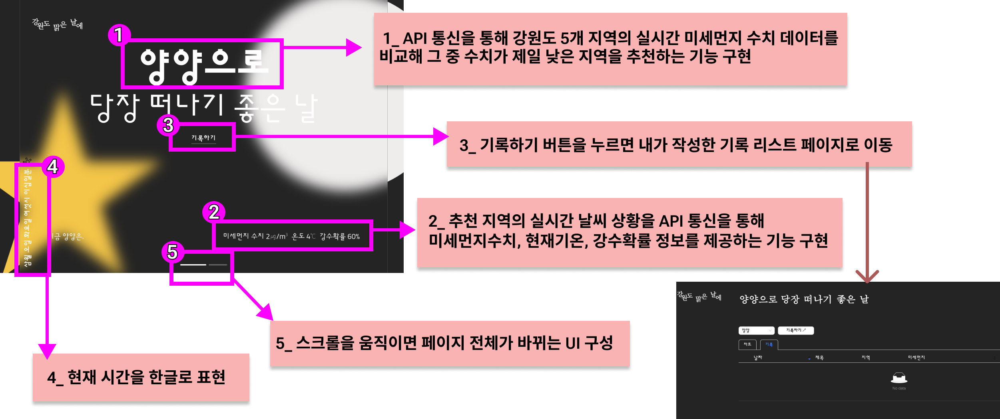
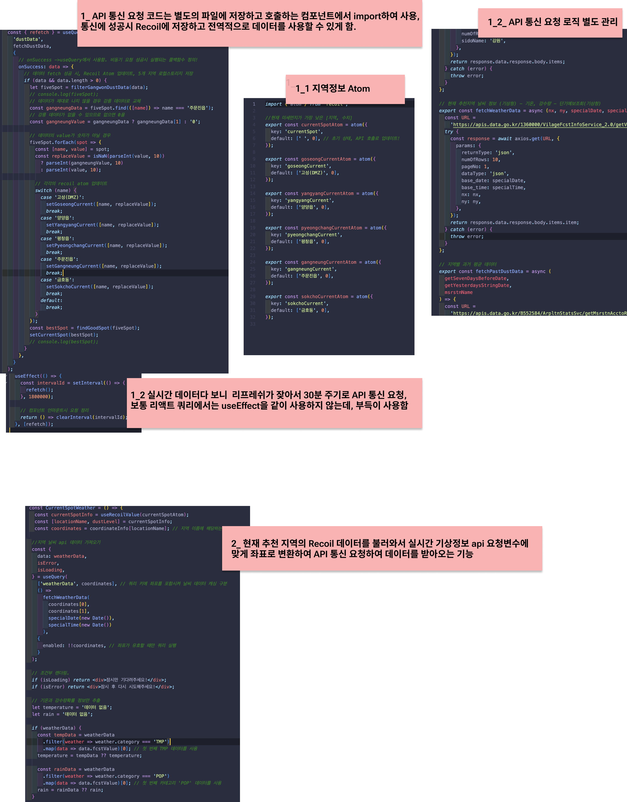
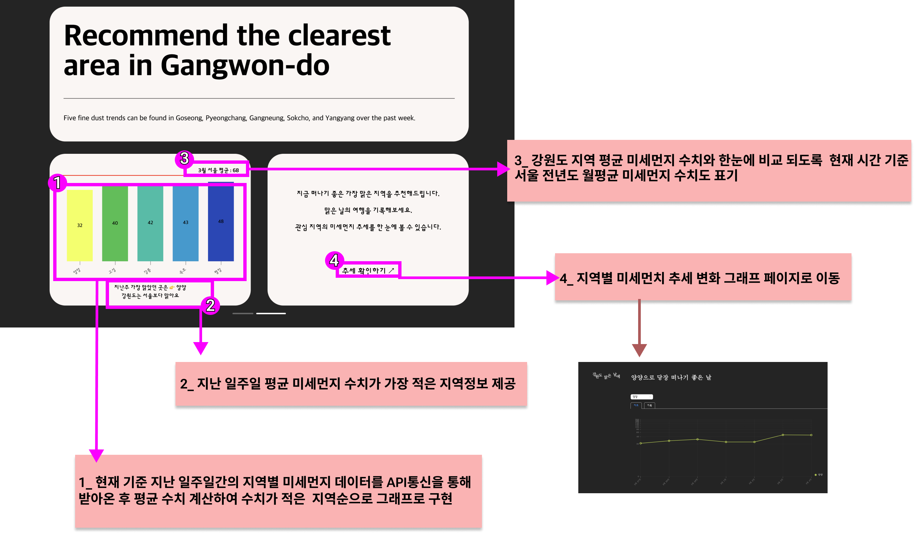
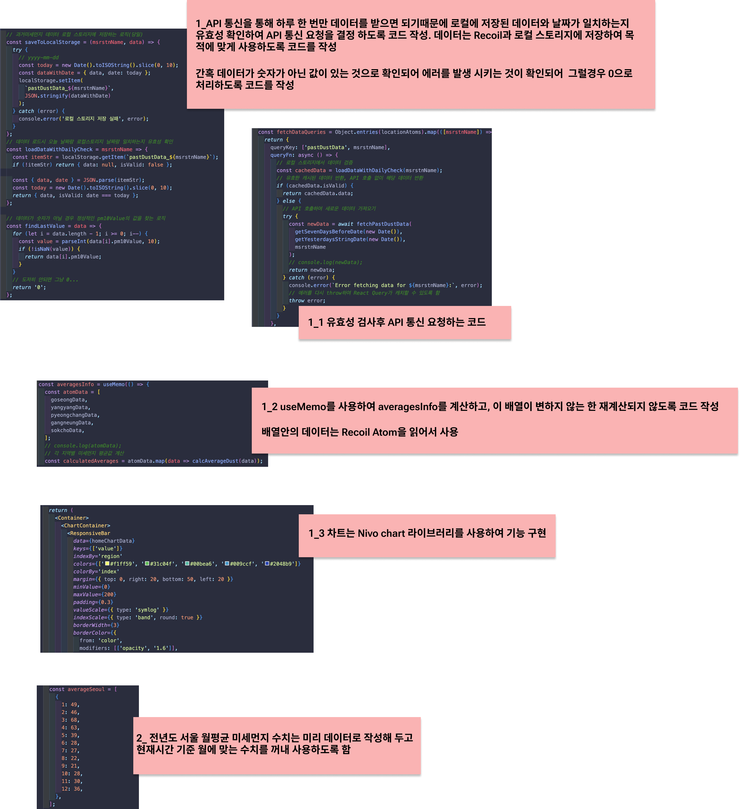
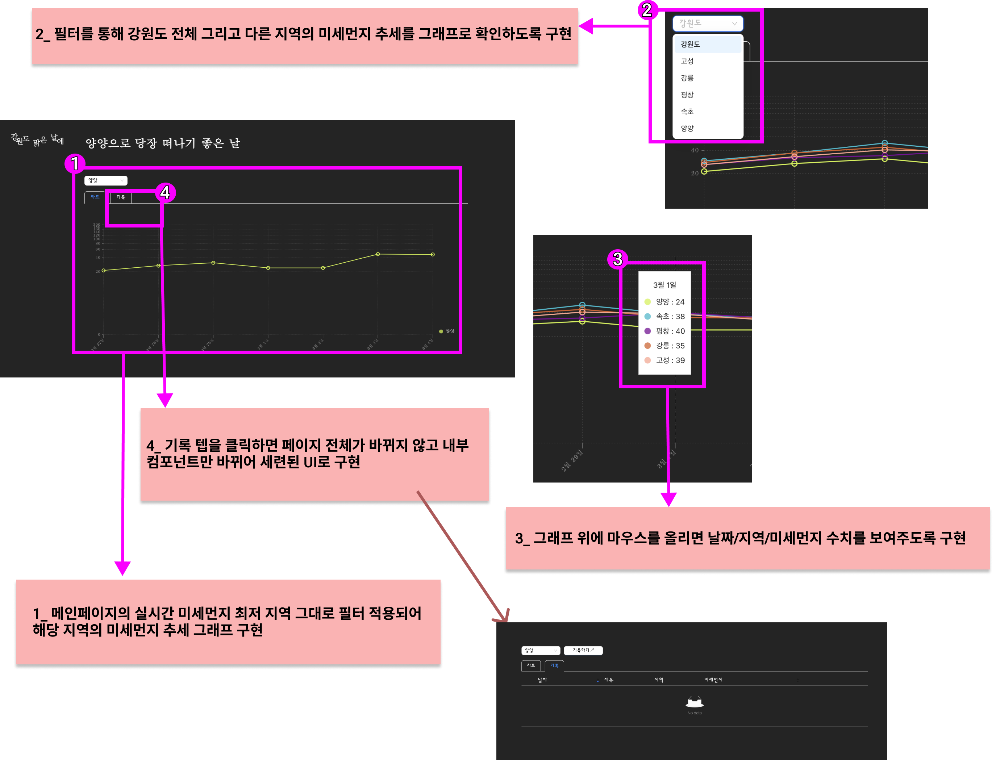
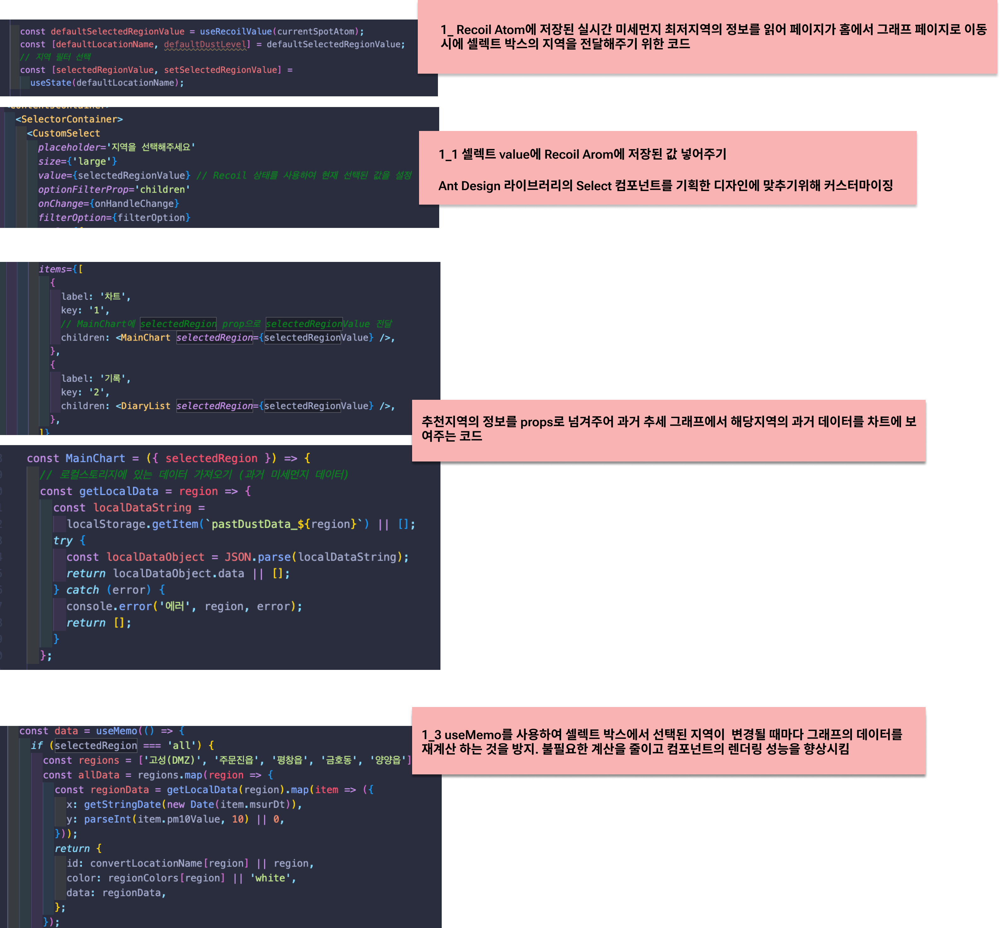
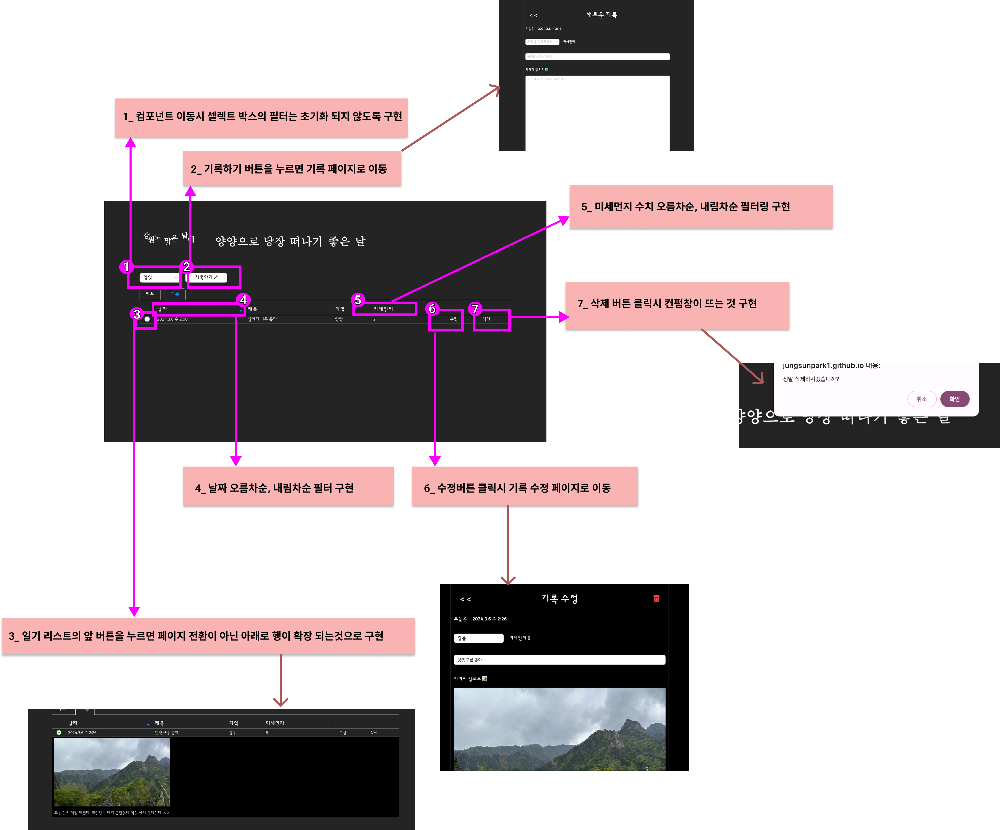
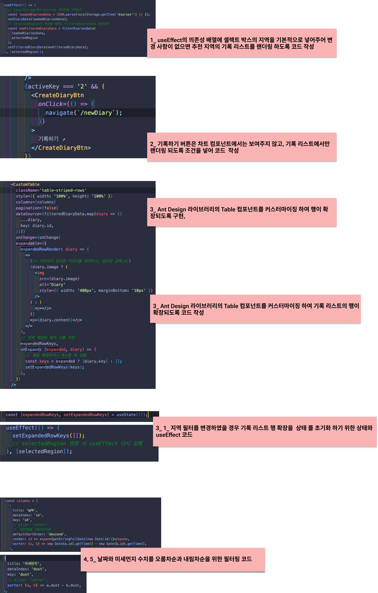
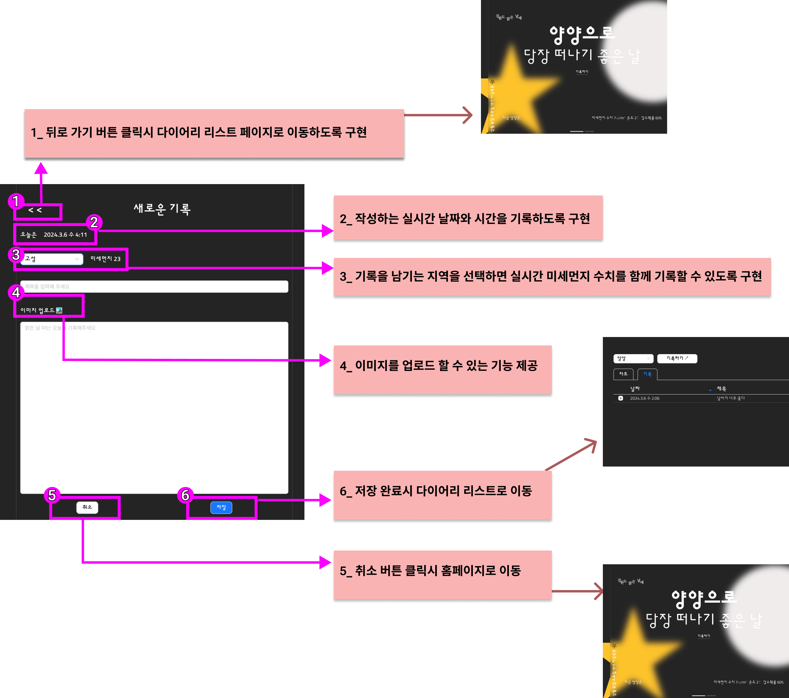

# 강원도 맑은 날에

   
  
   

## 프로젝트 URL

https://jungsunpark1.github.io/fineday-gangwon/

## 프로젝트 목표

맑은 날 떠나고 싶은 도시인들을 위해 강원도 주요 여행지 5곳을 선정해 실시간 미세먼지 수치가 가장 적은 지역을 추천합니다. 지역별 과거 미세먼지 수치를 그래프로 확인 하고 기록을 남기는 컨셉으로 기획, 디자인, 구현까지 반응형 웹 사이트로 완성했습니다.

 

## 프로젝트 기간

2023.12.29 ~ 2024. 02.18

 

## 프로젝트 진행 과정 정리 및 문제 해결 과정

https://bit.ly/3P7Xbfw

## 개발 환경

  - <b>운영체제</b>	: Mac OS
   
- <b>개발도구</b>	: Visual Studio Code, Oven(카카오 Prototyping tool), Figma
   
- <b>Language</b>: React, Html5, CSS3, JavaScript
   
- <b> Library & Framework </b>: React Query, Nivo chart, Ant design, Recoil, etc 
     
- <b>버전관리 시스템</b>	: Git
   
- <b>배포</b>	: GitHub
   

## 기술 스택

|  HTML   |  CSS   |  React   | JavaScript |
| :-----: | :----: | :------: | :--------: |
| ![html] | ![css] | ![react] |   ![js]    |

 

## 구현 기능

#### 홈 페이지 1 기능

  
  
   

#### 홈 페이지 1 상세 코드

    
  
   

#### 📍 홈 페이지 2 기능

    
  
   

#### 📍 홈 페이지 2 상세 코드

    
  
   

#### 📍 메인 페이지 - 차트 기능

    
  
   

#### 📍 메인 페이지 - 차트 상세 코드

    
  
   

#### 📍 메인 페이지 - 기록 리스트 기능

    
  
   

#### 📍 메인 페이지 - 기록 리스트 상세 코드

    
  
   

#### 📍 기록 작성 페이지 기능

    
  
   

#### 📍 기록 수정 페이지 기능

    
  
   
<!--  -->

[js]: ./introduce/icons/javascript.svg
[html]: ./introduce/icons/html.svg
[css]: ./introduce/icons/css.svg
[react]: ./introduce/icons/react.svg
